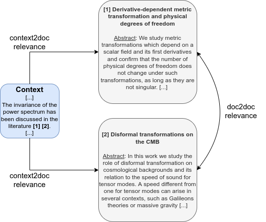

# Multi-objective Representation Learning for Scientific Document Retrieval



## Download data
To download the training data and the ICLR2022 benchmark for our S3 bucket, run `download_data.sh`:
```
source download_data.sh
```

## Training

### Single objective training

Command to run the training on `independent-cropping`:
```
python train.py \
    --save_dir logs/ \
    --data_dirs ./datasets/training-data/independent-cropping \
    --weights 100 \
    --batch_size 16 \
    --num_workers 2 \
    --steps 200000 \
    --grad_accum 2 \
    --val_check_interval 10000 \
    --pooling mean \
    --loss mnrl \
    --sampling mixed
```

### Multi-objective training
Command to run the training on `independent-cropping` and `unarxiv-q2d` using in-batch mixing with 50-50 mix:
```
python train.py \
    --save_dir logs/ \
    --data_dirs ./datasets/training-data/independent-cropping ./datasets/training-data/unarxiv-q2d \
    --weights 50 50 \
    --batch_size 16 \
    --num_workers 2 \
    --steps 200000 \
    --grad_accum 2 \
    --val_check_interval 10000 \
    --pooling mean \
    --loss mnrl \
    --sampling mixed
```

Command to run the training on `independent-cropping` and `unarxiv-q2d` using alternate batch:
```
python train.py \
    --save_dir logs/ \
    --data_dirs ./datasets/training-data/independent-cropping ./datasets/training-data/unarxiv-q2d \
    --batch_size 16 \
    --num_workers 2 \
    --steps 200000 \
    --grad_accum 2 \
    --val_check_interval 10000 \
    --pooling mean \
    --loss mnrl \
    --sampling alternate
```

## Evaluate

To run the evaluation on SciDocs, you should download the data following the instructions here: https://github.com/allenai/scidocs . We need the 3 metadata files: 
- `data/paper_metadata_mag_mesh.json`
- `data/paper_metadata_view_cite_read.json`
- `data/paper_metadata_recomm.json`

